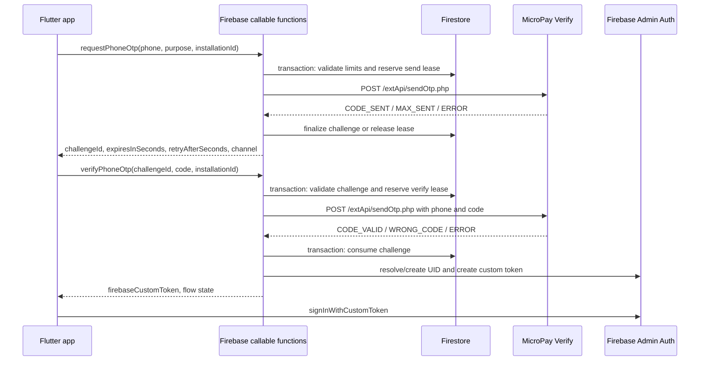

# MicroPay OTP migration plan

## 1. Goal and non-goals

Replace Firebase Phone Auth as the SMS/OTP provider with MicroPay Verify while preserving the current registration and phone-recovery user experience, validation, cooldowns, Hebrew errors, Firebase UIDs, sessions, and email/password login.

Firebase Auth remains the identity and session system. MicroPay is responsible only for generating, sending, and validating OTP codes. A successful MicroPay verification is converted server-side into a Firebase custom token, which the Flutter client exchanges for a normal Firebase session.

The current phone recovery flow is passwordless sign-in after phone ownership verification. It does not reset or change the password. This behavior remains unchanged.

## 2. Current behavior and affected code

### Registration

1. `lib/phone_registration_screen.dart` validates and normalizes the phone number.
2. It checks whether the phone is already registered.
3. `lib/services/phone_auth_verification_service.dart` calls Firebase Phone Auth. iOS uses the native diagnostics bridge in `ios/Runner/AppDelegate.swift`; other platforms use FlutterFire directly.
4. Firebase sends the code and returns a verification ID.
5. The client creates a `PhoneAuthCredential` and signs in with it.
6. `AuthService.finishPhoneVerificationAndCreateAuthAccount` links the synthetic email/password credential and writes the onboarding records.

### Phone recovery

1. `lib/widgets/forgot_password_sheet.dart` validates the phone and checks that it is registered.
2. Firebase sends and validates the SMS code.
3. `signInWithCredential` signs the user into the existing Firebase account.
4. `lib/login_screen.dart` routes the resulting user through the existing access/onboarding checks.

### Components that must remain

- `firebase_auth`, Firebase users, ID tokens, auth-state routing, and email/password login.
- Synthetic phone email format and existing account records, unless migrated separately later.
- `registered_phones` during the compatibility period.
- APNs and Firebase Messaging support used for push notifications.
- Existing onboarding, age, disabled/deleted-account, and completed-registration gates.

## 3. Target architecture

Only trusted Cloud Functions communicate with MicroPay. The MicroPay token must never be returned to Flutter, written to Firestore, committed to Git, or included in logs.



## 4. MicroPay contract

Use JSON `POST` requests to:

`https://www.micropay.co.il/extApi/sendOtp.php`

Approved initial configuration:

| Parameter | Value | Notes |
|---|---|---|
| `token` | Secret Manager value | Token with SMS permission |
| `phone` | digits only | Convert normalized E.164 to the provider-approved format |
| `type` | `sms` | SMS only; do not use `auto` without a separate product decision and active voice service/credit |
| `codelen` | `6` | Must also be sent during verification |
| `minvalid` | `5` | Five-minute validity; must also be sent during verification |
| `maxsms` | `3` | Maximum three SMS sends for the phone/challenge window; not a replacement for server rate limits |
| `lang` | `he` | Hebrew |
| `smsfrom` | `hundred` | Approved sender |
| `smstext` | `קוד האימות שלך הוא:` | MicroPay documents this as text placed before its generated code |

The desired rendered SMS is `קוד האימות שלך הוא: {code}`, where `{code}` represents the six-digit code generated and appended by MicroPay. The sender name already identifies the app, so the message body does not repeat it. The documented API describes `smstext` as a prefix rather than a placeholder template, so the request must not send the literal `{code}`.

This integration gate was completed on September 18, 2026:

1. Use a minimal server-side script or isolated test function that reads the configured secret and sends one real SMS through the same JSON contract planned for production.
2. Test the documented prefix value `קוד האימות שלך הוא:` without a literal `{code}`.
3. Confirm on a physical phone that exactly one six-digit code appears, `{code}` is not printed literally, punctuation/spacing are correct, and mixed Hebrew/Latin text is readable in RTL presentation.
4. If MicroPay appends the code in a visually confusing position, choose and approve a prefix that reads correctly when the provider appends the code. Do not attempt to add suffix text unless MicroPay confirms that the OTP endpoint supports it.
5. Record the exact accepted request fields and received rendering in the test evidence, then freeze `smstext` in server configuration before Flutter implementation begins.

The isolated production smoke test consumed one SMS and returned `CODE_SENT` on
the `sms` channel. A physical Israeli phone received exactly one message with
one six-digit code, without a literal `{code}` or duplicate code; punctuation,
spacing, mixed Hebrew/Latin text, and RTL rendering were approved. After that
contract test, product shortened the prefix to `קוד האימות שלך הוא:` because
`smsfrom=hundred` already identifies the app. Provider code-appending behavior
is unchanged.
The temporary smoke-test callable and its temporary authentication secret were
removed immediately after validation.

The MicroPay token has been created and stored using `firebase functions:secrets:set MICROPAY_OTP_TOKEN`. The implementation must bind that secret in both callable function option objects and read it only at runtime. Do not print or retrieve its value during implementation or deployment validation.

Parse the JSON response by normalized `message`, never by HTTP status or `status` alone:

```text
normalizedMessage = String(message ?? '').trim().toUpperCase()
```

Only exact allow-listed values may trigger state changes. Unknown values fail closed. Do not use broad substring matching for success.

| `message` | Meaning | Backend result |
|---|---|---|
| `CODE_SENT` | Request accepted for the reported channel | Finalize challenge as sent |
| `CODE_VALID` | Code is valid | Consume challenge and create a Firebase custom token |
| `WRONG_CODE` | Wrong or expired code | Increment attempts; return a safe OTP error |
| `MAX_SENT` | Provider send limit reached | Do not send/retry; return cooldown error |
| `ERROR` | Invalid parameter, token, permission, credit, or provider failure | Log sanitized description; return mapped generic error |
| anything else | Contract drift or malformed response | Fail closed and alert telemetry |

`status: 1` can accompany `WRONG_CODE` and `MAX_SENT`. It must not be interpreted as business success.

Set explicit connection and total request timeouts. Do not automatically retry an ambiguous send timeout because MicroPay may have accepted and billed the request before the connection failed. A user-initiated resend must pass the local cooldown first. Each successful resend issues a new code and immediately invalidates the previous code, even if the previous five-minute validity window has not elapsed. The challenge retains a single current-code generation and never permits verification against an older generation.

## 5. Backend modules and callable contracts

Keep `functions/index.js` as the export surface and place implementation in focused modules:

- `functions/phone_otp/micropay_client.js`: HTTPS client, timeout, strict response parser, sanitized provider errors.
- `functions/phone_otp/phone_normalization.js`: canonical phone normalization and provider formatting.
- `functions/phone_otp/challenge_store.js`: transactions, leases, counters, expiry, and cleanup helpers.
- `functions/phone_otp/identity_service.js`: registration/recovery identity resolution and custom-token issuance.
- `functions/phone_otp/errors.js`: internal error enum and callable error mapping.
- `functions/phone_otp/config.js`: non-secret OTP constants and migration mode.

Export two callable functions in `europe-west3`:

These endpoints remain Firebase callable functions (`onCall`), not raw `onRequest` handlers. The Flutter `cloud_functions` SDK then attaches the App Check token and applies the callable protocol automatically. Both definitions must bind the MicroPay secret and enforce App Check:

```js
const { defineSecret } = require('firebase-functions/params');
const { onCall } = require('firebase-functions/v2/https');

const micropayOtpToken = defineSecret('MICROPAY_OTP_TOKEN');

exports.requestPhoneOtp = onCall(
  {
    region: 'europe-west3',
    enforceAppCheck: true,
    secrets: [micropayOtpToken],
  },
  requestPhoneOtpHandler,
);

exports.verifyPhoneOtp = onCall(
  {
    region: 'europe-west3',
    enforceAppCheck: true,
    secrets: [micropayOtpToken],
  },
  verifyPhoneOtpHandler,
);
```

Using `onRequest` would require manually implementing and validating the HTTP/App Check contract and would not match the planned Flutter `httpsCallable` client. Do not mix the two endpoint types.

### `requestPhoneOtp`

Request:

```json
{
  "phone": "+972501234567",
  "purpose": "registration",
  "installationId": "random-installation-identifier",
  "clientVersion": "1.0.5+11"
}
```

Response:

```json
{
  "challengeId": "opaque-random-id",
  "expiresInSeconds": 300,
  "retryAfterSeconds": 60,
  "channel": "sms"
}
```

Processing order is mandatory:

1. Validate App Check according to rollout phase.
2. Validate payload size, purpose, installation ID, version, and phone format.
3. Normalize phone and derive a keyed HMAC hash for internal indexes/log correlation.
4. Perform purpose preflight server-side: registration rejects an active registered account; recovery requires an eligible active account.
5. In a Firestore transaction, enforce all local limits and acquire a short send lease.
6. Only after the transaction succeeds, call MicroPay.
7. In a second transaction, finalize `CODE_SENT` or release/mark the lease after failure.
8. Return no phone number, UID, provider description, or secret data.

### `verifyPhoneOtp`

Request:

```json
{
  "challengeId": "opaque-random-id",
  "code": "123456",
  "installationId": "random-installation-identifier",
  "clientVersion": "1.0.5+11"
}
```

Response:

```json
{
  "firebaseCustomToken": "firebase-custom-token",
  "purpose": "recovery",
  "isNewUser": false
}
```

Processing order:

1. Validate App Check and payload shape. The code must be exactly six ASCII digits.
2. Load the challenge by random ID and compare the installation binding using constant-time comparison where applicable.
3. Reject expired, consumed, locked, cancelled, or currently leased challenges before calling MicroPay.
4. Transactionally increment/reserve the verification attempt before the provider call.
5. Call MicroPay with the server-held phone, code, `codelen`, and `minvalid`.
6. On `WRONG_CODE`, persist the failed attempt and lock when the local maximum is reached.
7. On `CODE_VALID`, atomically mark the challenge consumed before issuing identity credentials. Replays return a deterministic consumed error and never another usable token.
8. Resolve the Firebase identity according to purpose and return a short-lived custom token.

Do not place the phone or code in callable errors. Keep public error codes stable so Flutter does not depend on provider wording.

## 6. Firestore server-only data model

Suggested collections are denied to clients by default rules and accessed only with Admin SDK.

### `phone_otp_challenges/{challengeId}`

```text
phoneCiphertext          encrypted canonical phone, or canonical phone only if encryption is unavailable
phoneHash                HMAC-SHA256 for equality/rate-limit indexes
purpose                  registration | recovery
installationHash         HMAC of installation ID
status                   sending | sent | verifying | consumed | failed | locked | expired
channel                  sms | vms | wa
createdAt / sentAt
expiresAt
retryAvailableAt
sendCount
verifyAttemptCount
sendLeaseExpiresAt
verifyLeaseExpiresAt
consumedAt
resolvedUid              written only after successful identity resolution
providerResultCode       allow-listed code only; no raw response
schemaVersion
```

Prefer encryption for the recoverable phone value and HMAC for indexing. A plain SHA-256 hash is insufficient because the Israeli phone-number space is enumerable. Store encryption and HMAC keys in Secret Manager and support key versioning.

### Rate-limit documents

Use separate sharded or scoped documents keyed by HMAC values:

- phone: strict per-destination limits;
- installation: per-install limits;
- IP prefix: coarse abuse protection, stored as a rotating HMAC rather than raw IP;
- global circuit breaker: cap unexpected spend during an incident.

Example initial limits must be configurable and tuned from production metrics:

- one send per phone per 60 seconds;
- three provider sends per phone per five-minute challenge window;
- three provider attempts per phone, followed by a full one-hour lock;
- bounded sends per phone per day;
- bounded sends per installation and IP window;
- five verification attempts per challenge;
- maximum one active challenge per phone and purpose.

Provider `maxsms` is the last line of defense. Every local rate-limit check and lease acquisition occurs before the provider request.

Configure Firestore TTL on `expiresAt`, but never depend on TTL deletion for authorization; expired records may remain for hours. Every read must enforce expiry in code.

## 7. Concurrency, idempotency, and abandoned flows

Do not create a Firebase user or a `users` document when sending an OTP. An abandoned pre-verification flow then leaves only an expiring challenge.

MicroPay verification is phone-based and does not return a transaction ID. Therefore the backend must permit only one active challenge per normalized phone/purpose. Resend operates on that same challenge, increments its code generation, resets its five-minute expiry from the successful resend time, and invalidates every older code immediately. The UI and backend must not create parallel challenge IDs to work around the three-send limit.

External MicroPay calls cannot participate in Firestore transactions. Use short leases:

1. Transaction changes the challenge to `sending` or `verifying` and sets a lease expiry.
2. The function performs the external call.
3. A second transaction finalizes the result only if it still owns the lease.
4. A crashed invocation leaves a recoverable lease that can expire; it must not allow an immediate duplicate billable send.

### Registration identity resolution after `CODE_VALID`

Use a per-phone identity reservation document and this precedence:

1. Read `registered_phones/{canonicalPhone}` using Admin SDK.
2. Query Firebase Admin Auth with `getUserByPhoneNumber`.
3. If either points to an active/completed account, reject registration as already registered.
4. If both point consistently to an incomplete legacy phone-registration UID, resume that UID rather than creating another user.
5. If they conflict, fail closed, emit a high-severity operational event, and require reconciliation. Never guess which UID owns the number.
6. If neither exists, acquire the phone reservation transactionally, then create the Auth user with `phoneNumber`.
7. Persist the reservation/UID result before returning the custom token.

Firebase Auth and Firestore cannot be committed atomically together. Implement a small state machine (`reserved`, `auth_created`, `mapped`, `completed`) and idempotent retries. If Auth creation succeeds but Firestore finalization fails, a retry must recover the user through `getUserByPhoneNumber` and finish mapping it. Do not blindly delete an Auth user during compensation because another retry may already have adopted it.

Add a scheduled server-side identity reconciler for operations that remain in `reserved`, `auth_created`, or `mapped` beyond their lease deadline:

1. Claim each stale operation with a transaction/lease so concurrent scheduled runs cannot process it twice.
2. Resolve the Auth user by recorded UID and canonical phone, then compare it with the reservation and `registered_phones` mapping.
3. If Auth exists and ownership is consistent, complete the missing Firestore mapping/state instead of creating a new UID.
4. If Auth does not exist, release a stale pre-creation reservation so a later verified registration can retry safely.
5. If ownership conflicts or an Auth user exists without enough evidence to adopt it, mark the operation `manual_review`, keep it blocked from reuse, and alert. Never automatically delete or reassign it.
6. Make reconciliation idempotent, bounded per run, observable, and covered by emulator tests. Retain operation records long enough to diagnose failures before TTL cleanup.

Closing the app after Auth creation must not be the cleanup trigger. The server state machine and reconciler own recovery, so completion does not depend on the client returning.

### Recovery identity resolution

Recovery must never create a user. It requires a consistent `registered_phones` mapping, Firebase Auth record, non-deleted private profile, and allowed onboarding/account state. Resolve the existing UID and issue a custom token for that UID only.

The server must preserve the existing age-restricted, disabled, deleted, and incomplete-registration behavior before issuing access. The client still runs its current post-sign-in gates as defense in depth.

## 8. Flutter implementation

Add `lib/services/phone_otp_service.dart` with injectable `FirebaseFunctions` and `FirebaseAuth` dependencies.

Public models:

- `PhoneOtpPurpose.registration` / `recovery`;
- `PhoneOtpChallenge` with challenge ID, expiry, resend delay, and channel;
- `PhoneOtpVerificationResult` with purpose, user, and `isNewUser`;
- provider-independent `PhoneOtpException` codes.

The service performs callable requests and, after a successful verify response, immediately calls `FirebaseAuth.signInWithCustomToken`. The custom token is held in memory only and never logged or persisted.

### Registration screen

In `lib/phone_registration_screen.dart`:

- replace `_verificationId`, `_resendToken`, and `_phoneCredential` with a `PhoneOtpChallenge`;
- replace Firebase callbacks with awaited `requestPhoneOtp` and `verifyPhoneOtp` calls;
- retain phone validation, six-digit input, auto-submit, busy state, 60-second countdown, focus behavior, and Hebrew messages;
- set `registrationFlowInProgress` before exchanging the custom token so global auth routing cannot interrupt onboarding;
- update `finishPhoneVerificationAndCreateAuthAccount` to require the already signed-in verified UID, phone, password, and profile draft, without a phone credential;
- assert that the current user's server-established phone identity matches the verified challenge before linking email/password;
- on exit, clean only an incomplete account owned by the current verified UID. Never delete an active account.

### Recovery sheet

In `lib/widgets/forgot_password_sheet.dart`:

- replace Firebase Phone Auth callbacks and credential creation with the OTP service;
- after custom-token sign-in, return the Firebase `User` exactly as today;
- retain existing login routing in `lib/login_screen.dart`;
- retain email reset as a completely separate Firebase email flow.

### Error mapping

Refactor `lib/services/phone_auth_error_messages.dart` into provider-independent OTP messages or add a new `phone_otp_error_messages.dart`. UI code receives only stable application codes:

| Application code | Hebrew behavior |
|---|---|
| `invalid-phone-number` | existing invalid-phone message |
| `phone-already-registered` | existing registration conflict message |
| `phone-not-registered` | existing recovery not-found message |
| `wrong-code` | code is incorrect |
| `code-expired` | request a new code |
| `too-many-attempts` | wait before retrying |
| `send-limit-reached` | resend cooldown/limit message |
| `network-error` | check connection and retry |
| `service-unavailable` | temporary generic failure |
| `account-disabled` | contact support |
| `account-conflict` | generic support-required error; telemetry contains correlation ID |

## 9. App Check and abuse controls

Both functions are pre-authentication endpoints, so Firebase Authentication cannot protect them. App Check, rate limits, strict validation, and spend controls are mandatory.

Both V2 callable definitions must include `enforceAppCheck: true`. This protects the billable pre-authentication endpoints from direct scripts and ensures Firebase rejects requests without a valid attestation token before the handler can call MicroPay. It supplements rather than replaces the pre-provider rate limits and spend circuit breaker.

Current repository history records iOS DeviceCheck exchange failures. Because enforcement is enabled in code, deployment to production is gated on completing these steps:

1. Fix Apple/Firebase App Check configuration and validate real release builds on iOS and Android.
2. Confirm `FirebaseAppCheck` activates before the first callable request and uses App Attest with the approved DeviceCheck fallback on iOS, and Play Integrity on Android.
3. Use App Check debug tokens only in local/debug environments; never ship a debug provider or token in a release build.
4. Validate enforcement against internal release builds before enabling MicroPay through the feature flag.
5. Verify accepted/invalid request ratios and old-version behavior. Old versions continue using Firebase Phone Auth and do not call these new endpoints.

If production attestation is not healthy, keep the MicroPay feature flag off rather than deploying an unprotected billable endpoint. Enforcement may be temporarily disabled only in an isolated emulator/internal test deployment with mocked or tightly budgeted SMS, never as the public production configuration.

The App Check test environment must be isolated from public traffic: use a separate Firebase staging project where available, or keep production migration mode at `firebase` while only explicitly selected internal builds can reach the MicroPay path. Apply a small MicroPay test budget/global send cap. Test both an allowed signed release build and negative requests with missing/invalid App Check tokens. A debug build or debug token is not sufficient evidence for rollout. Canary expansion is blocked until signed iOS and Android release builds complete request, resend, and verification on physical devices with enforcement enabled.

An installation ID is useful for rate limiting but is client-controlled and not proof of device identity. Treat App Check as the device attestation signal. Hash IP information with a rotating secret and define a short retention period.

Add a server-side kill switch that can stop new sends immediately when error rate or spend exceeds a threshold.

## 10. Compatibility and feature-flag rollout

Old store versions call Firebase Phone Auth directly and cannot understand the new callable flow. Therefore disabling the Firebase Phone provider before old-version retirement would break registration and recovery for those users.

Introduce an explicit migration mode read by the new app, preferably through Firebase Remote Config or a small public configuration callable:

- `firebase`: new client uses the current Firebase flow;
- `micropay_canary`: eligible percentage/builds use MicroPay, others use Firebase;
- `micropay`: supported new builds use MicroPay;
- `disabled`: emergency stop for OTP sends.

Rules:

- select one provider before requesting a code and pin it for the entire challenge;
- persist only the non-secret flow metadata needed to retain that decision across backgrounding, process death, and app restart: provider, purpose, challenge ID when applicable, and expiry; never persist the OTP or Firebase custom token;
- restore an unexpired MicroPay challenge with the same provider after restart; for a legacy Firebase flow that cannot safely restore its credential state, restart the flow with Firebase rather than re-evaluating the feature flag;
- clear the persisted provider selection only on successful completion, explicit cancellation, or expiry;
- include the selected provider in every request and verify it against the server-side challenge provider; reject mismatches rather than falling back;
- never verify a MicroPay challenge through Firebase or vice versa;
- record provider and app version in telemetry;
- do not switch an in-progress flow when the remote flag changes;
- keep Firebase Phone Auth and the iOS bridge intact throughout canary and rollback windows;
- only remove legacy code after the minimum supported app version is above the last Firebase-phone build and adoption/retention data confirms old versions are negligible or blocked by an approved forced-update policy.

Suggested rollout:

1. Backend deployed with no client traffic.
2. Internal/test builds on MicroPay.
3. Production build released with flag defaulting to Firebase.
4. Canary at 1%, 5%, 25%, 50%, then 100%, with explicit stop criteria.
5. Hold at 100% through at least one full release cycle.
6. Restrict public `registered_phones` reads after all supported clients use server lookups.
7. Disable Firebase Phone Auth only after legacy-client retirement.
8. Remove Flutter/iOS legacy phone-auth code in a later release, not in the migration release.

## 11. Firestore rules and privacy

Move registration/recovery phone existence checks and UID resolution to Cloud Functions. The current public `get` on `registered_phones` exposes account existence and identity metadata.

Do not change this rule during the first backend deployment because existing app versions use it for login and registration preflight. After compatible clients are adopted:

- deny all client access to `phone_otp_challenges`, rate-limit, reservation, and identity-operation collections;
- remove public `registered_phones` reads;
- provide server endpoints for any remaining pre-auth phone-to-login resolution;
- retain only the minimum authenticated writes still required, or move those writes server-side too.

Preserving the current explicit “phone exists/does not exist” messages also preserves account enumeration behavior. Product/security must explicitly choose whether exact parity is required or whether both flows should return a neutral response. The migration must not accidentally change this behavior.

## 12. Native cleanup

During rollout, retain the Firebase Phone Auth method channel and APNs handling in `ios/Runner/AppDelegate.swift` for old/fallback clients.

After retirement:

- remove only `phoneAuthChannelName`, diagnostic sanitizers used solely by phone auth, and the `verifyPhoneNumber` method handler;
- remove `Auth.auth().setAPNSToken` and `Auth.auth().canHandleNotification` only after confirming no remaining Firebase Auth feature requires them;
- preserve Firebase Messaging APNs token registration, notification delegates, and remote-notification handling required for push;
- remove APNs readiness waits from the registration and recovery OTP screens;
- remove obsolete Firebase-phone diagnostics after production logs confirm the MicroPay path is stable.

## 13. Observability

Use a generated correlation ID and structured events. Never log raw phone numbers, OTP codes, custom tokens, MicroPay tokens, full provider bodies, installation IDs, or raw IPs.

Track:

- request count and rate-limit rejection by purpose/provider/version;
- `CODE_SENT`, channel, `CODE_VALID`, `WRONG_CODE`, `MAX_SENT`, and sanitized `ERROR` category;
- send and verify latency, timeout rate, malformed response rate;
- conversion from sent to verified;
- Auth/Firestore identity conflicts and reconciliation outcomes;
- estimated SMS spend and global circuit-breaker activations.

Alert on unknown provider messages, token/permission/credit errors, elevated timeouts, identity conflicts, send spikes, and verification conversion drops.

Define retention for challenge and abuse data. TTL cleanup should minimize stored phone data after operational/audit needs expire.

## 14. Tests

### Backend unit tests

- exact, case-insensitive normalization of known MicroPay message codes;
- `status: 1` with `WRONG_CODE` and `MAX_SENT` is not success;
- unknown/missing message, malformed JSON, non-2xx HTTP, and timeout fail closed;
- phone normalization and provider formatting;
- no secrets/phone/code in serialized errors or logs;
- expiry, cooldown, maximum attempts, consumed challenge, and lease recovery;
- local rate-limit rejection occurs without invoking the MicroPay client;
- only one concurrent send/verify call obtains its lease.

### Backend emulator/integration tests

- registration of a new phone creates one UID and an idempotent mapping;
- duplicate concurrent registration creates no duplicate identity;
- retry after Auth-created/Firestore-failed resumes the same UID;
- scheduled reconciliation completes a consistent orphaned Auth UID, releases only safe pre-creation reservations, and sends conflicts to manual review without deletion;
- active registered phone is rejected for registration;
- recovery returns the existing UID and never creates users;
- missing, disabled, deleted, age-restricted, conflicting, and incomplete accounts follow existing policy;
- consumed/expired challenges cannot mint another token;
- after a successful resend, the previous code is rejected immediately and only the newest generation can verify;
- App Check modes and kill switch behave as configured;
- production callable functions reject missing/invalid App Check tokens before the MicroPay client is invoked;
- Firestore rules deny all client reads/writes to OTP internals.

### Flutter tests

- request success advances to code entry and starts the countdown;
- six digits auto-submit only once;
- wrong code permits the configured retry behavior;
- expired/limited/network/provider errors retain the expected UI state and text;
- resend cannot run before cooldown and remains pinned to its provider;
- provider selection survives backgrounding/process restart and an in-flight flow ignores later feature-flag changes;
- a provider/challenge mismatch fails without attempting either OTP provider;
- custom-token sign-in occurs before registration continuation/recovery navigation;
- closing registration cannot delete an active account;
- email password reset remains unchanged.

### Real-device acceptance

- iOS and Android, clean install and upgrade from the previous store version;
- registration, resend, wrong code, expired code, background/foreground, and app restart;
- recovery signs into the original UID with existing profile/data intact;
- old released app still works while Firebase Phone Auth is enabled;
- push notifications still work after eventual native cleanup;
- release App Check tokens are accepted;
- approved sender and Hebrew message render correctly on real Israeli carriers.
- signed iOS and Android release builds pass App Check enforcement on physical devices; missing/invalid tokens are rejected before any MicroPay call.

## 15. Deployment and rollback checklist

1. Confirm the existing `MICROPAY_OTP_TOKEN` has least-privilege SMS permission and obtain an approved sender.
2. Keep the configured secret in Firebase Secret Manager; do not transmit it in chat or print its value.
3. Configure Firestore TTL and required indexes.
4. Deploy the backend to an isolated test path with migration mode `firebase` for public users.
5. Run the blocking real-SMS prefix/RTL test and freeze the approved `smstext` before changing Flutter.
6. Run unit and emulator suites, including orphan reconciliation and provider-pinning tests.
7. Validate enforced App Check using signed iOS and Android release builds on physical devices with explicit cost limits.
8. Release the dual-provider client with Firebase as default.
9. Enable monitored canary stages and compare success, latency, and cost against Firebase.
10. For rollback, set mode to `firebase`; do not delete MicroPay challenges immediately because in-progress users need a clear restart path.
11. After stable adoption, remove public phone mapping reads, retire old versions, disable Firebase Phone Auth, and later remove legacy native/client code.

Stop a rollout stage on elevated send failures, verification conversion regression, identity conflicts, unexpected spend, App Check rejection, or loss of push behavior.

## 16. Required manual inputs and external actions

Confirmed decisions and completed actions:

- `MICROPAY_OTP_TOKEN` was entered directly through `firebase functions:secrets:set MICROPAY_OTP_TOKEN`;
- channel is SMS (`type=sms`);
- language is Hebrew (`lang=he`);
- code length is six digits (`codelen=6`);
- validity is five minutes (`minvalid=5`);
- provider maximum is three SMS sends (`maxsms=3`);
- a successful resend invalidates the previous code immediately;
- desired rendered text is `קוד האימות שלך הוא: {code}`; implementation uses the documented prefix behavior without a literal `{code}`;
- both production V2 callable functions use `enforceAppCheck: true` and bind `MICROPAY_OTP_TOKEN` through `secrets`.

Remaining account-owner inputs and actions:

- confirm the existing token has only the required SMS permission;
- approve the daily abuse thresholds after production test results;
- repair and validate Firebase App Check for production iOS and Android builds;
- choose whether exact account-existence messages remain or become enumeration-resistant;
- choose supported minimum app version and the policy/date for retiring old Firebase-phone builds;
- approve retention periods for encrypted challenge data, rate-limit hashes, and operational logs.

Approving sender identities, purchasing SMS credit, changing Apple/Firebase console configuration, validating secret permissions, and store release controls require account-owner access and cannot be completed solely through repository edits.

## 17. Completion criteria

The migration is complete only when:

- 100% of supported clients use MicroPay for registration and phone recovery;
- successful recovery returns the original Firebase UID;
- concurrent/replayed requests cannot create duplicate users or mint repeated sessions;
- local limits prevent provider calls before billable abuse occurs;
- no secret, OTP, raw phone, custom token, or raw IP appears in client code or logs;
- App Check enforcement works for supported release builds;
- old clients are retired before Firebase Phone Auth is disabled;
- Firestore no longer exposes `registered_phones` publicly;
- email/password login, onboarding gates, account restrictions, and push notifications pass regression testing.

## 18. References

- MicroPay OTP API: https://site.micropay.co.il/api/otp.php
- MicroPay authentication and tokens: https://site.micropay.co.il/api/auth.php
- MicroPay API conventions: https://site.micropay.co.il/api/conventions.php